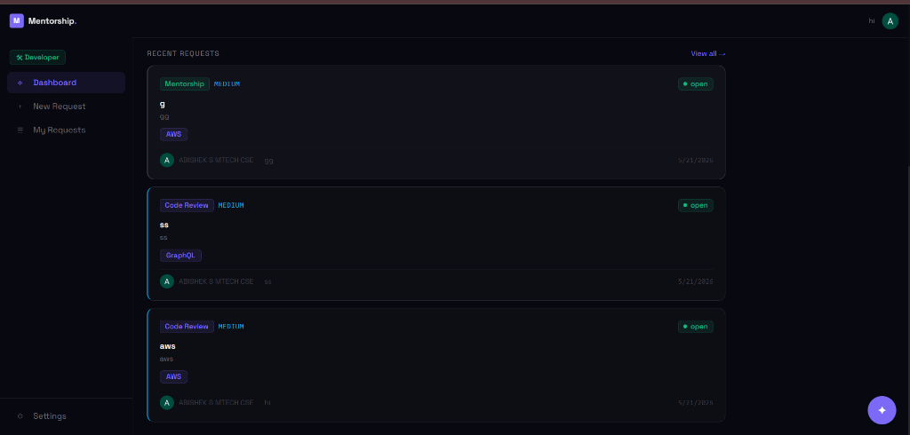
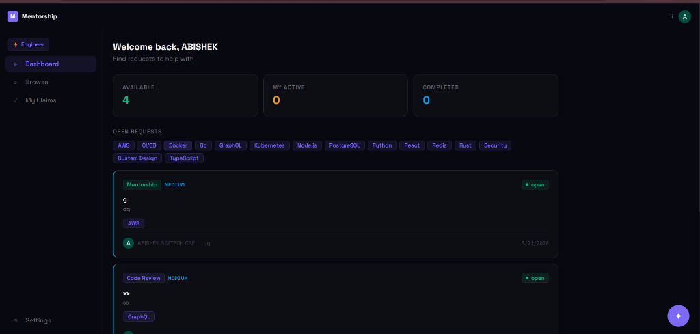
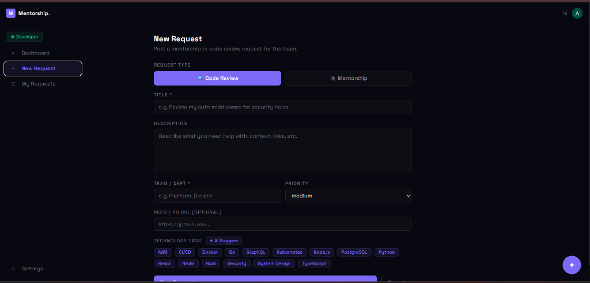
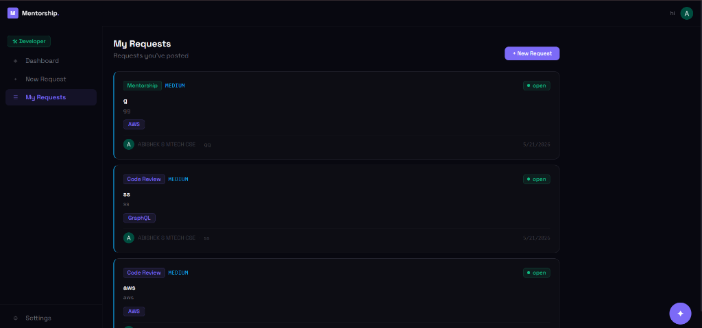
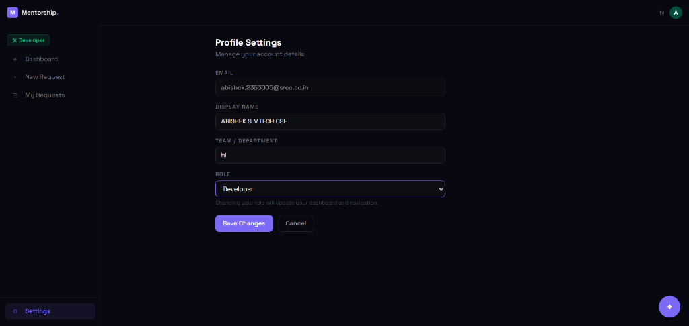
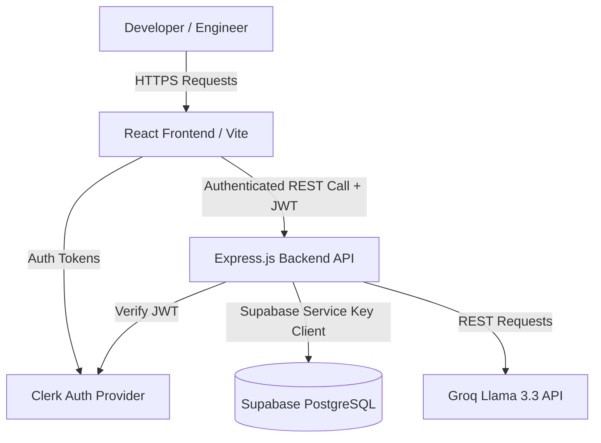
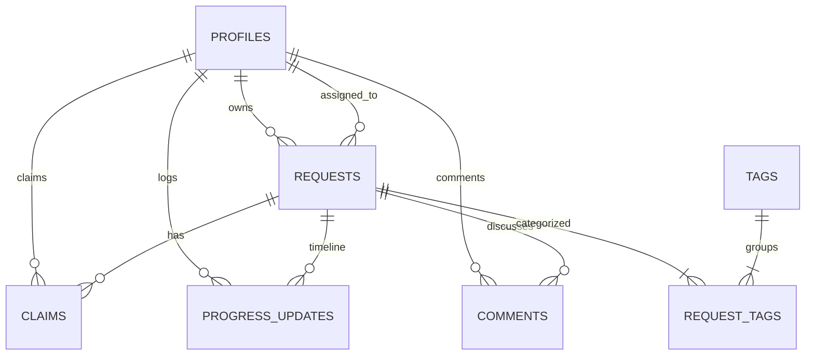

# Micro-Mentorship & Code Review Marketplace

[](#)
[](#)
[](#)
[](#)
[](#)

An internal peer-to-peer collaboration platform designed to eliminate code review bottlenecks, foster cross-team knowledge sharing, and streamline developer onboarding. By bridging developers requesting assistance with engineers ready to mentor, this marketplace makes engineering support visible and trackable.

---

## UI Showcase

### Developer Dashboard


### Engineer Dashboard


### Create a New Request


### My Requests


### Profile Settings & Role Gate


---

## 2. Features

### Core Workflows
*   **Request Posting:** Developers post mentorship or code review requests specifying type, description, team, priority, repository link, and tech tags.
*   **One-Click Claiming:** Engineers can claim active requests with a custom message, updating the status from `open` to `claimed`.
*   **Timeline Logs:** Track collaboration milestones via dedicated progress logs.
*   **Targeted Discussions:** Comment threads on individual requests to facilitate communication.
*   **Smart Onboarding:** Gated role selection (`developer` vs. `engineer`) and team assignment.

### AI Integrations
*   **AI Tag Suggester:** Recommends relevant technology tags based on the request's title and description.
*   **AI Semantic Search:** Analyzes natural language search queries to find matching requests.
*   **AI Assistant:** A persistent chat widget powered by Groq's Llama 3.3 model to answer technical queries anywhere on the platform.

---

## 3. Tech Stack

| Layer | Technology |
| :--- | :--- |
| **Frontend** | React 18, Vite, Tailwind CSS v3, React Router v6 |
| **Backend** | Node.js, Express.js (REST API) |
| **Database** | Supabase PostgreSQL |
| **Authentication** | Clerk (JWT token verification) |
| **AI Layer** | Groq API (Llama-3.3-70b-versatile) |
| **Hosting** | Vercel (Frontend), Render (Backend), Supabase Cloud (Database) |

---

## 4. System Architecture



*   **Authentication:** Clerk handles identities and issues JWTs. Endpoints are guarded by Express verification middleware.
*   **Data Pipeline:** The backend interacts with PostgreSQL using Supabase's secure service role client.
*   **AI Inference:** Express handles tag extraction, semantic search translation, and chat requests via Groq's API.

---

## 5. Folder Structure

```
micro-mentorship/
├── schema.sql
├── .gitignore
├── README.md
├── backend/
│   ├── index.js
│   ├── supabase.js
│   ├── .env.example
│   ├── package.json
│   ├── middleware/
│   │   └── auth.js
│   ├── routes/
│   │   ├── activity.js
│   │   ├── ai.js
│   │   ├── profile.js
│   │   ├── requests.js
│   │   └── tags.js
│   └── utils/
│       └── profile.js
└── frontend/
    ├── index.html
    ├── postcss.config.js
    ├── tailwind.config.js
    ├── vite.config.js
    ├── package.json
    ├── .env.example
    └── src/
        ├── main.jsx
        ├── App.jsx
        ├── api.js
        ├── index.css
        ├── components/
        │   ├── AiChat.jsx
        │   ├── AppLayout.jsx
        │   ├── Badges.jsx
        │   ├── Filters.jsx
        │   ├── NavBar.jsx
        │   ├── ProgressTimeline.jsx
        │   ├── RequestCard.jsx
        │   └── Sidebar.jsx
        ├── context/
        │   └── ProfileContext.jsx
        ├── hooks/
        │   └── useFetch.js
        ├── pages/
        │   ├── BrowseRequests.jsx
        │   ├── CreateRequest.jsx
        │   ├── DeveloperDashboard.jsx
        │   ├── EditRequest.jsx
        │   ├── EngineerDashboard.jsx
        │   ├── MyClaims.jsx
        │   ├── MyRequests.jsx
        │   ├── Onboarding.jsx
        │   ├── ProfileSettings.jsx
        │   └── RequestDetail.jsx
        └── utils/
            └── time.js
```

---

## 6. Database Schema Overview



*   **`profiles`**: Linked to Clerk user accounts (`clerk_id`). Stores names, emails, roles (`developer` / `engineer`), and team names.
*   **`tags`**: Stores unique technology keywords (`React`, `Go`, `PostgreSQL`, etc.).
*   **`requests`**: Contains request details, owner and assignee IDs, priority, and status (`open`, `claimed`, `in_progress`, `completed`, `cancelled`).
*   **`request_tags`**: Junction table mapping requests to technologies.
*   **`claims`**: Tracks interest signals sent by engineers wanting to pick up open requests.
*   **`progress_updates`**: Milestones posted by request participants to track resolution.
*   **`comments`**: Threaded communication entries on requests.

---

## 7. API Routes

### Endpoint Summary

| Method | Endpoint | Auth | Description |
| :--- | :--- | :--- | :--- |
| `GET` | `/api/health` | No | Health check. |
| `POST` | `/api/profile/sync` | Yes | Synchronizes Clerk authenticated session info. |
| `GET` | `/api/profile` | Yes | Retrieves authenticated profile record. |
| `PUT` | `/api/profile` | Yes | Updates name, team, or role details. |
| `GET` | `/api/tags` | No | Lists all database technologies. |
| `GET` | `/api/requests` | No | Lists requests (optional: type, status, tag, search). |
| `POST` | `/api/requests` | Yes | Posts a new request. |
| `PUT` | `/api/requests/:id` | Yes | Edits request details (owner only). |
| `DELETE` | `/api/requests/:id` | Yes | Deletes request (owner only). |
| `POST` | `/api/requests/:id/claim` | Yes | Claims a request for mentorship/review. |
| `PATCH` | `/api/requests/:id/status`| Yes | Modifies request state. |
| `POST` | `/api/requests/:id/progress`| Yes | Appends a timeline update. |
| `POST` | `/api/requests/:id/comments`| Yes | Submits a comment. |
| `POST` | `/api/ai/suggest-tags` | Yes | Returns suggested tags for a title/description. |
| `POST` | `/api/ai/search-tags` | Yes | Identifies tags in search query. |
| `POST` | `/api/ai/chat` | Yes | AI Assistant communication route. |

### Payload Example: `POST /api/requests`
```json
{
  "title": "PostgreSQL Query Performance Optimization",
  "description": "Our analytics query is executing sequential scans. Need index advice.",
  "type": "code_review",
  "team": "Data Platform",
  "priority": "high",
  "repo_url": "https://github.com/example/repo/pull/42",
  "tag_ids": ["c0a80164-9988-4f11-8f2c-6b3a2ea129cc"]
}
```

---

## 8. Installation Guide

1.  **Clone Repo:**
    ```bash
    git clone https://github.com/abishekji2005-bit/micro-mentorship.git
    cd micro-mentorship
    ```
2.  **Database Migration:**
    *   Create a project in **Supabase Dashboard**.
    *   Open **SQL Editor**, paste the contents of [schema.sql](file:///c:/Users/Abishek/Downloads/micro-mentorship/micro-mentorship/schema.sql), and run it.
3.  **Clerk Identity Setup:**
    *   Create an application at **Clerk.com**.
    *   Copy the Publishable and Secret Keys.
4.  **Backend Configuration:**
    ```bash
    cd backend
    cp .env.example .env
    # Edit .env and supply keys
    npm install
    npm run dev
    ```
5.  **Frontend Configuration:**
    ```bash
    cd ../frontend
    cp .env.example .env
    # Edit .env and supply Clerk publishable key
    npm install
    npm run dev
    ```

---

## 9. Environment Variables

### Backend Configuration (`backend/.env`)
```env
PORT=3001
FRONTEND_URL=http://localhost:5173

# Supabase Credentials
SUPABASE_URL=https://your-supabase-project.supabase.co
SUPABASE_SERVICE_KEY=your-supabase-service-key
SUPABASE_ANON_KEY=your-supabase-anon-key

# Clerk Credentials
CLERK_SECRET_KEY=your-clerk-secret-key

# Groq API Key
GROK_API_KEY=gsk_your-groq-key
```

### Frontend Configuration (`frontend/.env`)
```env
VITE_CLERK_PUBLISHABLE_KEY=your-clerk-publishable-key
VITE_API_URL=http://localhost:3001
VITE_SUPABASE_ANON_KEY=your-supabase-anon-key
```

---

## 10. Usage Flow

### For Developers
1. **Onboard:** Set your role to `developer` and assign yourself to a team.
2. **Request Help:** Click **New Request**, add details, and click **✦ AI Suggest** to automatically pick technologies.
3. **Collaborate:** Discuss requirements in the comments and close the request once resolved.

### For Engineers
1. **Onboard:** Register as an `engineer`.
2. **Find Work:** Check the dashboard for open items. Filter by tags or use **✦ AI Tags** to extract tags from a natural query.
3. **Help Out:** Claim a request and update the timeline log as progress is made.

---

## 11. UI/UX Design Philosophy

Designed for engineers who value dark-themed layouts and low-density layouts:
*   **Typography:** Space Grotesk for headers, IBM Plex Mono for UI controls and details.
*   **Harmonious Accents:** Dark backgrounds (`#080810`) matched with lavender (`#7c6af7`), emerald, sky, and amber status markers.
*   **Responsiveness:** Fluid grid columns and collapsing menus.

---

## 12. Security Considerations

*   **Row Level Security:** Handled in Supabase via database level policies.
*   **Token Verification:** Backend router uses Clerk verification filters on incoming requests.
*   **Input Sanitization:** Controllers validate body payloads to check request status.

---

## 13. Scalability Considerations

*   **Decoupled Architecture:** Separated Client/Server modules.
*   **Indexed Databases:** Columns frequently used for queries (like `clerk_id` and `status`) are indexed.
*   **Pool Connections:** Configured client limits to prepare for serverless operations.

---

## 14. Future Improvements

*   **Skill Matching:** AI recommendations based on engineers' profile histories.
*   **Real-time Collaboration:** WebSockets for instant timeline and comment sync.
*   **Vocal Feedback:** Integrations for GitHub review webhooks.

---

## 15. Deployment

### Frontend (Vercel)
1. Link the repository to **Vercel**.
2. Set build root directory to `frontend`.
3. Provide environment keys.
4. Click Deploy.

### Backend (Render/Heroku)
1. Link to **Render**.
2. Select Web Service.
3. Choose Node environment and run `npm install && npm start`.
4. Configure variables in settings.

---

## 16. Contributing

1. Fork the project.
2. Create your feature branch (`git checkout -b feature/FeatureName`).
3. Commit change logs (`git commit -m 'Add FeatureName'`).
4. Push to branch (`git push origin feature/FeatureName`).
5. Open a Pull Request.

---

## 17. Author

*   **abishekji2005-bit** — [abishekji2005@gmail.com](mailto:abishekji2005@gmail.com)
